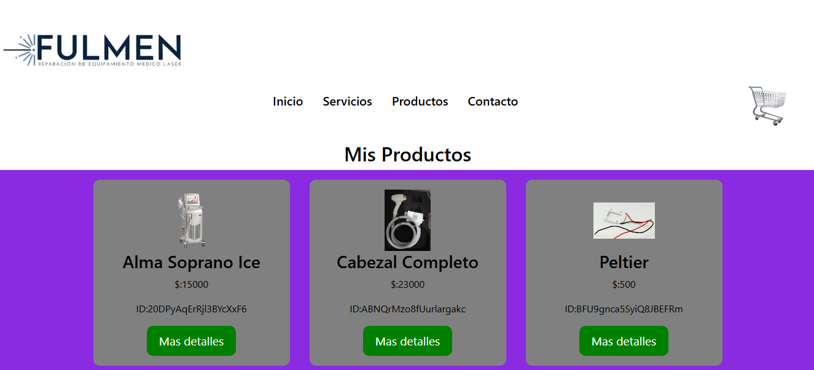

 Fulmen ventas de Productos de depilacion Laser.
Es una pagina web en desarrollo , es esta estapa se realizo la parte del e-commerce basico, que permite comprar on-line repuestos y maquinas. La tecnologia que se uso fue React js y las ordenes y productos, se almacenan en firebase. 

### Tecnologia utilizada:
* React
* Javascrip
* html 
* Css 
* Node js
* React router Dom
* Toastify
* Boostrap.

### Funcionalidades
* Ver lista de productos disponibles
* Agregar Productos al carrito
* Eliminar Productos del carrito
* Realizar la compra
* Formulario de compra

### imgenes de la parte principal de la pagina

